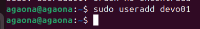

# 🖥️ PRÁCTICA 1 — ADMINISTRACIÓN DE SISTEMAS (UD4)

---

# 1. Gestión avanzada de usuarios y grupos

## 1.1 Crear usuario dev01 sin opciones

Crea un usuario llamado **dev01** utilizando `useradd` sin opciones adicionales.

```bash
sudo useradd dev01
```

### Comprobaciones

Comprobar si se ha creado su directorio personal:

```bash
ls /home
```

> Por defecto **no se crea el directorio personal**.



---

Comprobar su entrada en `/etc/passwd`.

```bash
cat /etc/passwd | grep dev01
```

📸 Captura 

---

Comprobar su grupo por defecto en `/etc/group`.

```bash
cat /etc/group | grep dev01
```

📸 Captura

---

## 1.2 Mostrar configuración por defecto de useradd

Mostrar la configuración por defecto del sistema para la creación de usuarios.

```bash
useradd -D
```

📸 Captura

---

## 1.3 Crear usuario dev02 con directorio personal

Crea un segundo usuario llamado **dev02** utilizando la opción para crear automáticamente su directorio personal.

```bash
sudo useradd -m dev02
```

Comprobar el directorio:

```bash
ls /home
```

📸 Captura

---

## 1.4 Comprobar contenido de /etc/skel

Mostrar el contenido del directorio `/etc/skel`.

```bash
ls /etc/skel
```

📸 Captura

---

## 1.5 Crear usuario dev03 con adduser

Crear un tercer usuario llamado **dev03** utilizando:

```bash
sudo adduser dev03
```

### Comprobaciones

Entrada en `/etc/passwd`:

```bash
cat /etc/passwd | grep dev03
```

📸 Captura

---

Entrada en `/etc/shadow`:

```bash
sudo cat /etc/shadow | grep dev03
```

📸 Captura

---

Grupo asociado:

```bash
groups dev03
```

📸 Captura

---

## 1.6 Mostrar configuración de adduser

Mostrar el contenido del archivo `/etc/adduser.conf`.

```bash
cat /etc/adduser.conf
```

📸 Captura

---

## 1.7 Cambiar al usuario dev01

```bash
su dev01
```

Si no permite acceso, asignar contraseña:

```bash
sudo passwd dev01
```

📸 Captura

---

## 1.8 Crear grupo devs

```bash
sudo addgroup devs
```

📸 Captura

---

## 1.9 Añadir usuarios al grupo

Añadir los tres usuarios al grupo devs.

```bash
sudo usermod -aG devs dev01
sudo usermod -aG devs dev02
sudo usermod -aG devs dev03
```

### Comprobación

Primera forma:

```bash
groups dev01
```

Segunda forma:

```bash
cat /etc/group | grep devs
```

📸 Captura

---

## 1.10 Trabajar con el usuario dev03

Cambiar de usuario:

```bash
su dev03
```

Crear directorio:

```bash
mkdir ~/grupo
```

📸 Captura

---

## 1.11 Crear archivo con miembros del grupo

Generar archivo con los usuarios del grupo devs.

```bash
getent group devs > ~/grupo/members.txt
```

📸 Captura

---

## 1.12 Mostrar permisos del archivo

```bash
ls -l ~/grupo/members.txt
```

📸 Captura

---

## 1.13 Modificar permisos

Solo el propietario puede modificar, el grupo puede leer y otros sin acceso.

```bash
chmod 640 ~/grupo/members.txt
```

Comprobar:

```bash
ls -l ~/grupo/members.txt
```

📸 Captura

---

## 1.14 Bloquear usuario dev02

```bash
sudo usermod -L dev02
```

> El sistema añade un `!` delante del hash de la contraseña en `/etc/shadow`.

📸 Captura

---

## 1.15 Desbloquear usuario

```bash
sudo usermod -U dev02
```

📸 Captura

---

## 1.16 Configurar caducidad de usuario

```bash
sudo chage -E 2026-12-31 dev03
```

Comprobar configuración:

```bash
chage -l dev03
```

📸 Captura

---

## 1.17 Eliminar usuarios

Eliminar usuario:

```bash
sudo userdel dev01
```

Comprobar si existe el directorio:

```bash
ls /home
```

📸 Captura

---

Eliminar usuario junto con su directorio personal:

```bash
sudo userdel -r dev02
```

📸 Captura

---

# 2. Seguridad y permisos

## 2.1 Crear estructura de directorios

Estructura:

```
/project
/project/code
/project/tests
```

Crear directorios:

```bash
sudo mkdir -p /project/code
sudo mkdir -p /project/tests
```

📸 Captura

---

## 2.2 Crear archivos de prueba

```bash
touch /project/code/test_Alexis.txt
touch /project/tests/test_Alexis.txt
```

📸 Captura

---

## 2.3 Cambiar grupo propietario

```bash
sudo chown :devs /project/code
```

📸 Captura

---

## 2.4 Configurar permisos

```bash
sudo chmod 770 /project/code
sudo chmod 755 /project/tests
```

📸 Captura

---

## 2.5 Activar bit SGID

```bash
sudo chmod g+s /project/code
```

> El bit SGID hace que los archivos nuevos hereden el grupo del directorio.

📸 Captura

---

## 2.6 Mostrar permisos

Formato largo:

```bash
ls -l /project
```

Formato numérico:

```bash
stat /project/code
```

📸 Captura

---

## 2.7 Modificar umask

```bash
umask 027
```

Crear archivo de prueba:

```bash
touch prueba.txt
ls -l
```

📸 Captura

---

## 2.8 Cambiar propietario y grupo

```bash
sudo chown usuario:grupo archivo
```

📸 Captura

---

## 2.9 Acceso restringido

Intentar acceder con usuario sin permisos.

```bash
cd /project/code
```

📸 Captura

---

# 3. Servicios y procesos

## 3.1 Listar servicios activos

```bash
systemctl list-units --type=service
```

📸 Captura

---

## 3.2 Servicios habilitados al inicio

```bash
systemctl list-unit-files --type=service
```

📸 Captura

---

## 3.3 Estado del servicio SSH

```bash
systemctl status ssh
```

📸 Captura

---

## 3.4 Habilitar y deshabilitar servicio

```bash
sudo systemctl enable servicio
sudo systemctl disable servicio
```

📸 Captura

---

## 3.5 Detener e iniciar servicio

```bash
sudo systemctl stop servicio
sudo systemctl start servicio
```

📸 Captura

---

## 3.6 Procesos por CPU

```bash
ps aux --sort=-%cpu
```

📸 Captura

---

## 3.7 Procesos por memoria

```bash
ps aux --sort=-%mem
```

📸 Captura

---

## 3.8 Información de proceso por PID

```bash
ps -p PID -f
```

📸 Captura

---

## 3.9 Finalizar proceso

```bash
kill PID
```

📸 Captura

---

## 3.10 Ver logs del sistema

```bash
journalctl -u servicio
```

📸 Captura